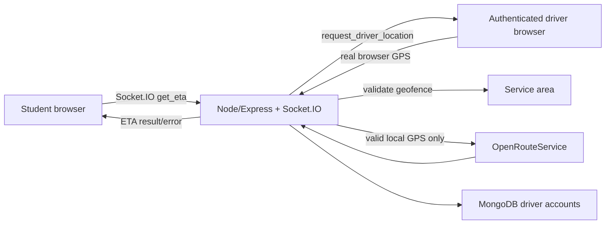

# Real-Time Local Shuttle ETA System

A real-time local shuttle ETA system using React, Node.js, Socket.IO, MongoDB, browser geolocation, and OpenRouteService.

This project is built for a local shuttle route. It does not simulate buses or calculate ETAs for drivers outside the configured service area.

## Architecture



## Tech Stack

- React and Vite frontend
- Node.js, Express, and Socket.IO backend
- MongoDB with Mongoose
- JWT driver authentication
- bcrypt password hashing
- Browser Geolocation API
- OpenRouteService matrix API
- Node test runner

## Environment Variables

Backend, in `backend/.env`:

```env
PORT=8000
DB_URI=
API_KEY=
FRONTEND_URL=http://localhost:5173
JWT_SECRET=
SERVICE_AREA_NAME=Meerut local service area
SERVICE_AREA_CENTER_LAT=28.9845
SERVICE_AREA_CENTER_LNG=77.7064
SERVICE_AREA_RADIUS_KM=15
ETA_REQUEST_TIMEOUT_MS=10000
```

Frontend, in `frontend/.env`:

```env
VITE_BACKEND_URL=http://localhost:8000
```

Use production HTTPS URLs for `FRONTEND_URL` and `VITE_BACKEND_URL` when deployed. `FRONTEND_URL` can be a comma-separated allowlist.

## Local Setup

```bash
cd backend
npm install
cp .env.example .env
npm run dev
```

In another terminal:

```bash
cd frontend
npm install
cp .env.example .env
npm run dev
```

Open the frontend URL printed by Vite, usually `http://localhost:5173`.

## Running Tests

```bash
cd backend
npm test
```

The tests cover Haversine distance, in-area and out-of-area geofence checks, pending ETA timeout cleanup, and the rule that invalid or out-of-area GPS coordinates never trigger an OpenRouteService call.

## Two-Browser Real-Mode Test

1. Start MongoDB, the backend, and the frontend.
2. In a normal browser window, open the student page.
3. In an incognito window or another device, open `/driver/signup` and create a driver account.
4. Log in at `/driver/login` with bus number and password.
5. Allow browser location permission on the driver dashboard.
6. Confirm the dashboard shows `Active - inside service area`.
7. In the student window, select a backend-provided stop and request ETA.
8. The backend asks the driver socket for a fresh GPS fix, validates the geofence, calls OpenRouteService, and returns bus number, driver name, and ETA.

If the driver denies location permission, is outside the configured service area, disconnects, or does not respond before `ETA_REQUEST_TIMEOUT_MS`, the student receives a clear error instead of a fake ETA.

## Local Geofence Rule

Every driver socket is authenticated, but authentication alone does not make the driver eligible for ETA requests. The driver must provide real browser GPS coordinates within:

- `SERVICE_AREA_NAME`
- `SERVICE_AREA_CENTER_LAT`
- `SERVICE_AREA_CENTER_LNG`
- `SERVICE_AREA_RADIUS_KM`

Drivers outside the radius are marked `outside_service_area` and are not ETA candidates. The backend never sends OpenRouteService requests for invalid or out-of-area driver coordinates.

## Deployment Notes

- Set `FRONTEND_URL` to the deployed frontend origin, not `*`.
- Set `VITE_BACKEND_URL` to the deployed backend origin.
- Set a strong `JWT_SECRET`.
- Set `DB_URI` to the production MongoDB connection string.
- Set `API_KEY` to an OpenRouteService API key.
- Configure HTTPS for both frontend and backend so browser geolocation works reliably.
- Keep `.env` files out of Git. Use the checked-in `.env.example` files as templates.

## Future Walkthrough Video

Add a screen-recorded live walkthrough here showing:

- driver signup and login
- driver geolocation permission
- student stop selection
- real ETA request and response
- outside-service-area handling

